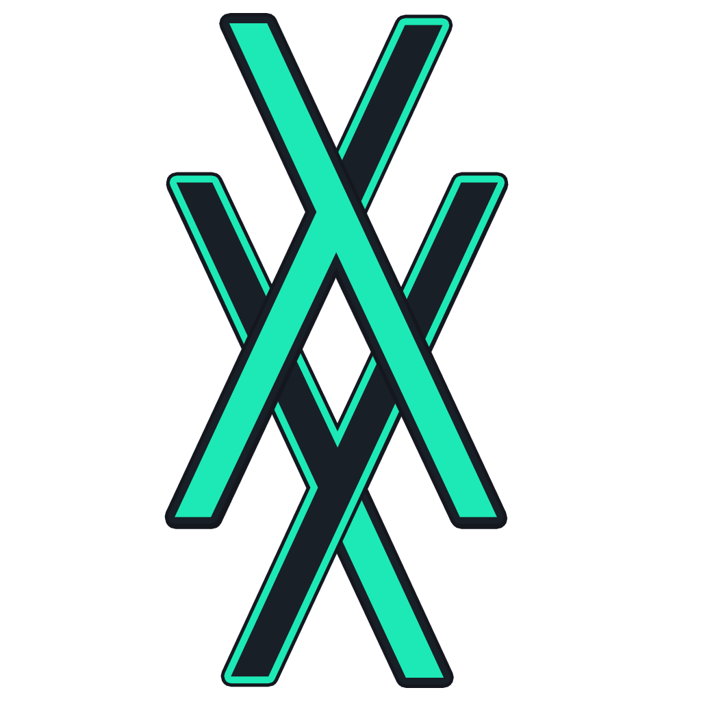

# Mdyna
### A note application with markdown support and code highlighting
[](https://mdyna.github.io)
[](https://circleci.com/gh/mdyna/mdyna-app);

_Built with React+Redux+Electron_

### Markdown support
### Card labels
### Code syntax highlight
### Focus mode for the editor
### Repeatable cards with statistics
### Release Notes
### Markdown support
dyna supports Git flavoured markdown.
## Card labels
dyna also has support for card labels, which you can use to categorize your cards and filter them.
## Card colors
In case labels aren't enough, you may want to assign different colors based on cards
## Code syntax highlight
dyna supports conde syntax highlighting, likeso:

```javascript
    //javascript
    const dyna = "Awesome"
    console.log("Mdyna is ", dyna)
```

Supporting multiple languages:
```python
    #python
    dyna = "Love"
    print("Mdyna is", dyna)
```

## Repeatable cards with statistics
dyna allows you to create repeatable cards, or tasks, which will show you an analysis of how you've been upholding them.

### Built by
[David Morais](https://github.com/psybork)